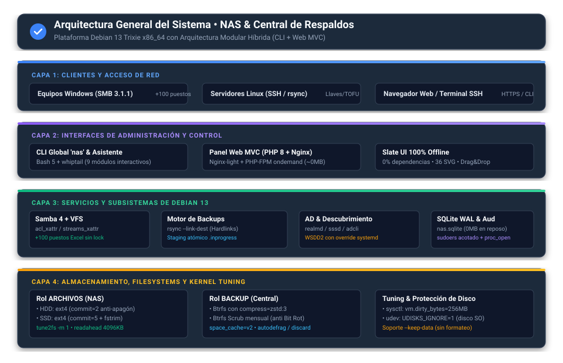

# Servidor NAS y Central de Respaldos Multiplataforma (Debian 13)

[-A81D33?style=for-the-badge&logo=debian&logoColor=white)](https://github.com/ftole/nas_debian) [](https://github.com/ftole/nas_debian) [](https://github.com/ftole/nas_debian) [](https://github.com/ftole/nas_debian)

Este repositorio contiene las herramientas para desplegar y administrar sobre **Debian 13 (Trixie)** un servidor de almacenamiento en red (NAS departamental) y una central de copias de seguridad resistente a ransomware. 

Todo el sistema corre de forma **nativa** sobre Linux, sin capas de virtualización pesadas ni dependencias externas. Puedes controlarlo completamente desde la terminal (con el comando `nas` o el asistente visual en consola) o a través de su panel web administrativo MVC (PHP 8 + Nginx-light), diseñado para consumir prácticamente cero recursos en reposo.

---

## 🏛️ Arquitectura General

El servidor combina el rendimiento del kernel de Debian 13 con interfaces ágiles pensadas tanto para la consola como para el navegador:



---

## 📚 Documentación Técnica Detallada

Para mantener este repositorio organizado y este documento directo al grano, el detalle técnico completo se encuentra estructurado en el directorio [`docs/`](docs/):

| Documento | ¿Qué encontrarás allí? |
| :--- | :--- |
| 🏗️ **[Arquitectura del Sistema](docs/arquitectura.md)** | Desglose profundo de capas, kernel sysctl, VFS Samba, SQLite WAL y concurrencia. |
| ⚡ **[Características y Capacidades](docs/caracteristicas.md)** | Roles del servidor, soporte para +100 puestos en Office/Excel, papelera web y terminal interactiva. |
| 🧰 **[Tecnologías Usadas y Cuadro Maestro](docs/tecnologias.md)** | Inventario técnico completo de cada componente, demonio y parámetro del kernel con sus beneficios. |
| 🛡️ **[Seguridad y Endurecimiento](docs/seguridad.md)** | Defensa en profundidad, UFW, SSH blindado, credenciales `0600`, proc_open seguro y rollback. |
| 🎨 **[Sistema de Diseño Slate UI y UX](docs/diseno.md)** | Tokens visuales, filosofía 100% offline, 36 iconos SVG nativos y diseño sereno. |
| 🔧 **[Operación Diaria y Mantenimiento](docs/operacion_mantenimiento.md)** | Guía de uso diario, restauración de archivos, checklist preventivo y tareas programadas. |
| 🚨 **[Posibles Problemas, Soluciones y FMEA](docs/problemas_soluciones.md)** | Diagnóstico paso a paso de fallos comunes y matriz de resiliencia con pruebas BATS. |

---

## 🎯 Dos Roles Especializados

Durante el despliegue puedes elegir entre dos roles mutuamente excluyentes, optimizados según su función:

| Característica | Rol `ARCHIVOS` (NAS Departamental) | Rol `BACKUP` (Central de Respaldos) |
| :--- | :--- | :--- |
| **Uso principal** | Compartición diaria de documentos | Repositorio histórico e inmutable de copias |
| **Visibilidad en red** | Carpetas visibles en el Explorador | Carpetas ocultas (con sufijo `$`) |
| **Filesystem en HDD** | `ext4` con `commit=2` (vaciado en 2s anti-apagón) | `Btrfs` con compresión `zstd:3` + scrub mensual |
| **Filesystem en SSD** | `ext4` con `commit=5` + `fstrim.timer` | `Btrfs` con compresión `zstd:3` + `discard=async` |
| **Acceso permitido** | Usuarios departamentales según permisos | Solo administradores (`grp_sistemas`) |
| **Reutilización de datos** | Soporte `--keep-data` (montar sin formatear) | Soporte `--keep-data` (montar sin formatear) |

---

## 💻 Resumen del Stack Tecnológico

Una síntesis clara de los componentes centrales que hacen funcionar el sistema:

| Subsistema | Tecnología Principal | Beneficio Clave |
| :--- | :--- | :--- |
| **Base del Sistema** | Debian 13 (Trixie) x86_64 | Máxima estabilidad y compatibilidad directa con hardware moderno. |
| **Almacenamiento** | `ext4` / `Btrfs` condicional | Resistencia a apagones en NAS y deduplicación con compresión en Backups. |
| **Servicio de Red** | Samba 4 + VFS `acl_xattr` & `streams_xattr` | Permite más de 100 usuarios simultáneos en Microsoft Office/Excel sin bloqueos `~$`. |
| **Descubrimiento** | WSDD2 con systemd override | Detección inmediata en Windows 10/11 sin protocolos inseguros como NetBIOS broadcast. |
| **Motor de Backups** | `rsync` con Hardlinks + Staging atómico | Ahorro superior al 85% de espacio en disco y protección total ante copias incompletas. |
| **Panel Administrativo** | Nginx-light + PHP 8 MVC (`pm = ondemand`) | Consumo nulo en reposo (~0 MB de RAM) y cero dependencias de internet (100% offline). |
| **Base de Datos** | SQLite 3 en modo WAL (PDO) | Cero memoria en reposo, concurrencia sin bloqueos y respaldos con copia simple. |
| **Interfaz Consola** | `nas` CLI + `whiptail` Bash 5 | Menús guiados de 9 módulos para administración completa sin interfaz gráfica. |

*(Para consultar el cuadro técnico exhaustivo componente por componente, revisa [Tecnologías Usadas](docs/tecnologias.md)).*

---

## 🚀 Instalación Rápida

### Requisitos Previos
- Servidor o equipo con **Debian 13 (Trixie)** x86_64 recién instalado.
- Acceso con privilegios de `root` o usuario en el grupo `sudo`.
- Conexión a Internet durante la descarga inicial de paquetes.
- Disco secundario opcional para `/srv/nas` (se puede formatear desde cero o reutilizar con sus datos intactos usando `--keep-data`).

### Opción A: Instalador Remoto Oficial (Recomendado)

Ejecuta el siguiente comando en la consola de tu servidor:

```bash
curl -fsSL https://raw.githubusercontent.com/ftole/nas_debian/main/install.sh | sudo bash
```

*(Si utilizas `wget`: `wget -qO- https://raw.githubusercontent.com/ftole/nas_debian/main/install.sh | sudo bash`)*

> [!TIP]
> El instalador descarga el código en `/opt/nas_debian`, registra el comando global `nas` y presenta el asistente visual. **No toca tus discos ni particiones hasta que lo autorices expresamente.**

---

### Opción B: Preparación Manual Paso a Paso

Si prefieres auditar y preparar el servidor manualmente antes de iniciar el asistente, sigue estos pasos en orden:

#### 1. Bootstrap como `root` (Pasos 1 al 7)

Accede a la sesión de `root`:
```bash
su -
```

Configura los repositorios APT en formato deb822 (`/etc/apt/sources.list.d/debian.sources`) y actualiza el sistema:
```bash
cat << 'SOURCES' > /etc/apt/sources.list.d/debian.sources
Types: deb deb-src
URIs: http://deb.debian.org/debian
Suites: trixie trixie-updates
Components: main contrib non-free non-free-firmware

Types: deb deb-src
URIs: http://security.debian.org/debian-security
Suites: trixie-security
Components: main contrib non-free non-free-firmware
SOURCES

: > /etc/apt/sources.list
apt update && apt upgrade -y
```

Instala las herramientas base y cortafuegos:
```bash
apt install -y curl wget ca-certificates htop ufw sudo fail2ban unattended-upgrades
```

Configura tu usuario administrador con acceso a `sudo`:
```bash
ADMIN_USER="$(awk -F: '$3 >= 1000 && $3 < 60000 && $1 != "nobody" {print $1; exit}' /etc/passwd)"
ADMIN_USER="${ADMIN_USER:-nas}"
id "$ADMIN_USER" &>/dev/null || adduser --disabled-password --gecos "" "$ADMIN_USER"
usermod -aG sudo "$ADMIN_USER"
echo "$ADMIN_USER ALL=(ALL:ALL) ALL" > "/etc/sudoers.d/90-admin"
chmod 0440 "/etc/sudoers.d/90-admin"
echo "Administrador listo: $ADMIN_USER"
```

Sal de la sesión de `root`:
```bash
exit
```

#### 2. Endurecimiento como Administrador con `sudo` (Pasos 8 al 13)

Desactiva el acceso directo de `root` por SSH:
```bash
sudo sed -i 's/^#*PermitRootLogin.*/PermitRootLogin no/' /etc/ssh/sshd_config
grep -rl "PermitRootLogin" /etc/ssh/sshd_config.d/ 2>/dev/null | xargs -r sudo sed -i 's/^#*PermitRootLogin.*/PermitRootLogin no/'
sudo systemctl restart ssh || sudo systemctl restart sshd
```

Configura las reglas del cortafuegos UFW:
```bash
sudo ufw default deny incoming
sudo ufw default allow outgoing
sudo ufw allow 22/tcp comment 'SSH'
sudo ufw allow 80/tcp comment 'Panel Web HTTP'
sudo ufw allow 443/tcp comment 'Panel Web HTTPS'
sudo ufw allow 137,138/udp comment 'Samba NetBIOS'
sudo ufw allow 139,445/tcp comment 'Samba SMB'
sudo ufw allow 3702/udp comment 'WSDD2 Discovery UDP'
sudo ufw allow 3702/tcp comment 'WSDD2 Discovery TCP'
sudo ufw allow 5355/udp comment 'WSDD2 LLMNR UDP'
sudo ufw allow 5355/tcp comment 'WSDD2 LLMNR TCP'
sudo ufw allow 5357/tcp comment 'WSDD2 HTTP'
sudo ufw --force enable
```

Evita que el servidor se suspenda o hiberne:
```bash
sudo systemctl mask sleep.target suspend.target hibernate.target hybrid-sleep.target
sudo mkdir -p /etc/systemd/logind.conf.d
printf '[Login]\nHandleSuspendKey=ignore\nHandleHibernateKey=ignore\nHandleLidSwitch=ignore\n' | sudo tee /etc/systemd/logind.conf.d/99-nas.conf >/dev/null
sudo systemctl restart systemd-logind
```

Inicia fail2ban:
```bash
sudo cp /etc/fail2ban/jail.conf /etc/fail2ban/jail.local
sudo systemctl enable --now fail2ban
```

---

## 🛠️ Comandos Globales del CLI `nas`

Una vez instalado, tienes a tu disposición el comando global `nas`:

| Comando | Función |
| :--- | :--- |
| `sudo nas` | Inicia el asistente interactivo de menús (TUI). |
| `sudo nas status` | Realiza un diagnóstico completo de salud (servicios, discos, recursos, backups). |
| `sudo nas update` | Sincroniza con GitHub, valida sintaxis y realiza rollback automático si hay errores. |
| `sudo nas version` | Muestra la versión y el commit exacto instalado. |
| `sudo nas uninstall` | Desinstala el software y limpia las configuraciones del servidor. |

---

## 🖥️ Módulos del Asistente Interactivo

Al ejecutar `sudo nas` accederás a un menú visual guiado con 9 módulos:

```text
┌─────────────────────────────────────────────────────────────┐
│                 PANEL DE GESTIÓN NAS DEBIAN                 │
├─────────────────────────────────────────────────────────────┤
│  [1] Desplegar servidor       -> Asistente guiado en 5 pasos│
│  [2] Gestión de grupos        -> Crear/eliminar grupos grp_*│
│  [3] Recursos compartidos     -> Crear/administrar Samba    │
│  [4] Tareas de backup         -> Central de copias de red   │
│  [5] Usuarios                 -> Cuentas del sistema y SMB  │
│  [6] Diagnóstico de salud     -> Chequeo en vivo del estado │
│  [7] Reiniciar servicios      -> Recarga limpia de demonios │
│  [8] Actualizar software      -> Descarga segura con rollback│
│  [9] Desinstalar              -> Limpieza total del sistema │
└─────────────────────────────────────────────────────────────┘
```

---

## 💾 Despliegue Automatizado por Línea de Comandos

Si necesitas desplegar servidores de forma desatendida mediante scripts:

```bash
# Servidor NAS en disco secundario (/dev/sdb) formateando desde cero:
printf '%s\n' '<CLAVE_ADMIN>' | sudo bash src/core/deploy.sh /dev/sdb WORKGROUP SRV-NAS admin - ARCHIVOS

# Servidor NAS conservando datos preexistentes en /dev/sdb (--keep-data):
printf '%s\n' '<CLAVE_ADMIN>' | sudo bash src/core/deploy.sh /dev/sdb WORKGROUP SRV-NAS admin - ARCHIVOS --keep-data

# Central de Respaldos formateando disco secundario (/dev/sdb):
printf '%s\n' '<CLAVE_ADMIN>' | sudo bash src/core/deploy.sh /dev/sdb WORKGROUP SRV-BKP admin - BACKUP
```

---

## 📂 Estructura del Repositorio

```text
nas_debian/
├── install.sh             -> Instalador remoto oficial y gestor CLI `nas`
├── docs/                  -> Documentación técnica completa y guías operativas
│   ├── assets/            -> Diagramas vectoriales SVG del sistema
│   ├── arquitectura.md    -> Arquitectura detallada, capas y flujo de procesos
│   ├── caracteristicas.md -> Capacidades del NAS, Office/Excel y panel web
│   ├── diseno.md          -> Sistema de diseño Slate UI, tokens y UX
│   ├── operacion_mantenimiento.md -> Operación diaria, backups y checklist
│   ├── problemas_soluciones.md    -> Solución de problemas y modos de fallo FMEA
│   ├── seguridad.md       -> Modelo de seguridad y blindaje en profundidad
│   └── tecnologias.md     -> Cuadro maestro y justificación técnica
├── src/
│   ├── asistente.sh       -> Asistente visual TUI (menú principal)
│   ├── core/              -> Motores de despliegue, actualización y desinstalación
│   ├── lib/               -> Librerías auxiliares (colores, entorno, discos)
│   └── modules/           -> Módulos del asistente (shares, backups, users, etc.)
├── web/                   -> Panel web nativo MVC en PHP 8 (Nginx + PHP-FPM)
├── tests/                 -> Pruebas automatizadas (BATS, pytest y PHP CLI)
└── AGENTS.md              -> Contexto técnico maestro y reglas de ingeniería
```

---

## ⚖️ Licencia

Este proyecto es propiedad exclusiva de su autor. Todos los derechos reservados. Consulta el archivo [LICENSE](LICENSE).
