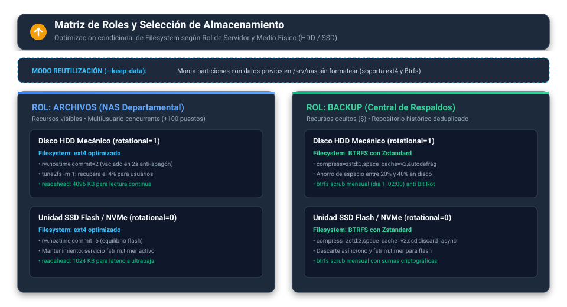

# Servidor NAS y Central de Respaldos Multiplataforma (Debian 13)

[-A81D33?style=for-the-badge&logo=debian&logoColor=white)](https://github.com/ftole/nas_debian) [](https://github.com/ftole/nas_debian) [](https://github.com/ftole/nas_debian) [](https://github.com/ftole/nas_debian)

Este repositorio contiene las herramientas para desplegar y administrar sobre **Debian 13 (Trixie)** un servidor de almacenamiento en red (NAS departamental) y una central de copias de seguridad resistente a ransomware. 

Todo el sistema corre de forma **nativa** sobre Linux, sin capas de virtualización pesadas ni dependencias externas. Puedes controlarlo completamente desde la terminal (con el comando `nas` o el asistente visual en consola) o a través de su panel web administrativo MVC (PHP 8 + Nginx-light), diseñado para consumir prácticamente cero recursos en reposo.

---

## 🏛️ Arquitectura General

El servidor combina el rendimiento del kernel de Debian 13 con interfaces ágiles pensadas tanto para la consola como para el navegador:


---

## 📚 Documentación Técnica Detallada

Para mantener este repositorio organizado y este documento directo al grano, el detalle técnico completo se encuentra estructurado en el directorio [`docs/`](docs/):

| Documento | ¿Qué encontrarás allí? |
| :--- | :--- |
| 🏗️ **[Arquitectura del Sistema](docs/arquitectura.md)** | Desglose profundo de capas, kernel sysctl, VFS Samba, SQLite WAL y concurrencia. |
| ⚡ **[Características y Capacidades](docs/caracteristicas.md)** | Roles del servidor, soporte para +100 puestos en Office/Excel, papelera web y terminal interactiva. |
| 🧰 **[Tecnologías Usadas y Cuadro Maestro](docs/tecnologias.md)** | Inventario técnico completo de cada componente, demonio y parámetro del kernel con sus beneficios. |
| 🛡️ **[Seguridad y Endurecimiento](docs/seguridad.md)** | Defensa en profundidad, UFW, SSH blindado, credenciales `0600`, proc_open seguro y rollback. |
| 🎨 **[Sistema de Diseño Slate UI y UX](docs/diseno.md)** | Tokens visuales, filosofía 100% offline, 36 iconos SVG nativos y diseño sereno. |
| 🔧 **[Operación Diaria y Mantenimiento](docs/operacion_mantenimiento.md)** | Guía de uso diario, restauración de archivos, checklist preventivo y tareas programadas. |
| 🚨 **[Posibles Problemas, Soluciones y FMEA](docs/problemas_soluciones.md)** | Diagnóstico paso a paso de fallos comunes y matriz de resiliencia con pruebas BATS. |

---

## 🎯 Tres Roles Especializados (`ARCHIVOS`, `BACKUP`, `ARCHIVOS_BACKUP`)

Durante el despliegue puedes configurar tu máquina para uno de tres perfiles según tus necesidades operativas:

- **Rol ARCHIVOS (NAS Departamental):** Diseñado para compartir carpetas en red a toda la oficina. Utiliza **ext4 optimizado** (`commit=2` en HDD para soportar cortes de energía), expone recursos visibles en el explorador de Windows y soporta más de 100 puestos simultáneos trabajando en hojas de cálculo de Excel sin bloqueos temporales (`~$`). En el panel web, restringe el módulo de respaldos y concentra la operativa en recursos compartidos (`/shares`).
- **Rol BACKUP (Central de Respaldos):** Diseñado como caja fuerte para recibir copias de servidores Windows, Linux y locales. Utiliza **Btrfs con compresión Zstandard** (`zstd:3`), deduplicación por enlaces duros (`rsync --link-dest` con >85% de ahorro), recursos ocultos terminados en `$` y revisiones mensuales automáticas contra corrupción silenciosa (*Bit Rot*). En el panel web, restringe el módulo de recursos abiertos y concentra la gestión en tareas de copias de seguridad (`/backups`).
- **Rol ARCHIVOS_BACKUP (Híbrido - Archivos y Respaldos):** La solución integral que combina ambas funciones en un único servidor. Permite desplegar recursos compartidos departamentales visibles para la red corporativa y, de manera paralela, programar respaldos automatizados multiplataforma con carpetas protegidas. En el panel web, **habilita simultáneamente tanto Recursos Compartidos (`/shares`) como Tareas de Respaldo (`/backups`)**, adaptando la navegación, métricas y permisos en tiempo real.

### Persistencia del Rol y Comportamiento en el Panel Web
El rol seleccionado se guarda de forma inmutable en `/etc/nas/role`. El backend web (`SystemService`) lee este archivo dinámicamente y el middleware de control de acceso (`AuthMiddleware`) adapta el acceso a rutas y la navegación lateral, mostrando además el badge correspondiente (`ARCHIVOS`, `BACKUP` o `ARCHIVOS & BACKUP`) en la cabecera. Todos los roles admiten el modo **`--keep-data`** para reutilizar discos sin formatear.



*(Conoce todos los detalles en la [Guía de Características](docs/caracteristicas.md)).*

---

## 💻 Resumen del Stack Tecnológico

El sistema aprovecha al máximo el rendimiento nativo del kernel de Debian 13 en lugar de envolver todo en contenedores lentos:

- **Almacenamiento Inteligente:** `ext4` transaccional anti-apagón para NAS y `Btrfs` con compresión `zstd:3` + scrub mensual para respaldos.
- **Samba 4 con VFS Avanzado:** Módulos `acl_xattr`, `streams_xattr` y `full_audit` para emular ADS de Windows, permitir concurrencia masiva en Office y registrar operaciones.
- **Descubrimiento Moderno WSDD2:** Los clientes Windows 10/11 ven el NAS al instante en el Explorador de Red sin protocolos antiguos inseguros.
- **Panel Web MVC 100% Offline:** Nginx-light con PHP-FPM en modo `pm = ondemand` (~0 MB de RAM en reposo) y base de datos SQLite WAL (`/var/lib/nas/nas.sqlite`).

*(Consulta el inventario componente por componente en [Tecnologías Usadas](docs/tecnologias.md)).*

---

## 🚀 Instalación y Puesta en Marcha

### Requisitos Previos
- Servidor o equipo con **Debian 13 (Trixie)** x86_64 recién instalado.
- Acceso con privilegios de `root` o usuario en el grupo `sudo`.
- Conexión a Internet durante la descarga inicial de paquetes.
- Disco secundario opcional para `/srv/nas` (puedes formatearlo o reutilizarlo con sus datos intactos usando `--keep-data`).

### Opción A: Instalador Remoto Oficial (Recomendado)

En la consola de tu servidor ejecuta:

```bash
curl -fsSL https://raw.githubusercontent.com/ftole/nas_debian/main/install.sh | sudo bash
```

*(Si utilizas `wget`: `wget -qO- https://raw.githubusercontent.com/ftole/nas_debian/main/install.sh | sudo bash`)*

> [!TIP]
> El instalador descarga los archivos en `/opt/nas_debian`, registra el comando global `nas` y abre el asistente visual en consola. **No tocará tus discos ni particiones hasta que lo confirmes expresamente.**

### Opción B: Preparación Manual Paso a Paso

Si por políticas corporativas de auditoría prefieres auditar y ejecutar cada paso manualmente (actualización de repositorios, cortafuegos UFW, endurecimiento SSH, fail2ban y despliegue), consulta nuestra [Guía de Preparación Manual Paso a Paso](docs/operacion_mantenimiento.md#7-preparación-y-despliegue-manual-paso-a-paso).

---

## 🛠️ Comandos Globales del CLI `nas`

Una vez instalado, tienes a tu disposición el comando global `nas`:

| Comando | Función |
| :--- | :--- |
| `sudo nas` | Inicia el asistente interactivo de menús (TUI). |
| `sudo nas status` | Realiza un diagnóstico completo de salud (servicios, discos, recursos, backups). |
| `sudo nas update` | Sincroniza con GitHub, valida sintaxis y realiza rollback automático si hay errores. |
| `sudo nas version` | Muestra la versión y el commit exacto instalado. |
| `sudo nas uninstall` | Desinstala el software y limpia las configuraciones del servidor. |

---

## 🖥️ Módulos del Asistente Interactivo

Al ejecutar `sudo nas` accederás a un menú visual guiado con 9 módulos:

```text
┌─────────────────────────────────────────────────────────────┐
│                 PANEL DE GESTIÓN NAS DEBIAN                 │
├─────────────────────────────────────────────────────────────┤
│  [1] Desplegar servidor       -> Asistente guiado en 5 pasos│
│  [2] Gestión de grupos        -> Crear/eliminar grupos grp_*│
│  [3] Recursos compartidos     -> Crear/administrar Samba    │
│  [4] Tareas de backup         -> Central de copias de red   │
│  [5] Usuarios                 -> Cuentas del sistema y SMB  │
│  [6] Diagnóstico de salud     -> Chequeo en vivo del estado │
│  [7] Reiniciar servicios      -> Recarga limpia de demonios │
│  [8] Actualizar software      -> Descarga segura con rollback│
│  [9] Desinstalar              -> Limpieza total del sistema │
└─────────────────────────────────────────────────────────────┘
```

---

## 💾 Despliegue Automatizado por Línea de Comandos

Si necesitas desplegar servidores de forma desatendida mediante scripts:

```bash
# Servidor NAS en disco secundario (/dev/sdb) formateando desde cero:
printf '%s\n' '<CLAVE_ADMIN>' | sudo bash src/core/deploy.sh /dev/sdb WORKGROUP SRV-NAS admin - ARCHIVOS

# Servidor NAS conservando datos preexistentes en /dev/sdb (--keep-data):
printf '%s\n' '<CLAVE_ADMIN>' | sudo bash src/core/deploy.sh /dev/sdb WORKGROUP SRV-NAS admin - ARCHIVOS --keep-data

# Central de Respaldos formateando disco secundario (/dev/sdb):
printf '%s\n' '<CLAVE_ADMIN>' | sudo bash src/core/deploy.sh /dev/sdb WORKGROUP SRV-BKP admin - BACKUP

# Servidor Híbrido (Archivos y Respaldos combinados) en partición local o disco secundario:
printf '%s\n' '<CLAVE_ADMIN>' | sudo bash src/core/deploy.sh LOCAL WORKGROUP SRV-NAS admin - ARCHIVOS_BACKUP
```

---

## 🪟 Asistente de Administración Remota en Windows (`nas_admin.bat` / `nas_admin.py`)

Para administrar, desplegar y monitorear el servidor remotamente desde cualquier equipo Windows (mediante consola PowerShell, CMD o directamente con doble clic) sin preocuparse por dependencias de Python ni configuraciones manuales de entorno:

### Lanzador Automatizado Oficial `nas_admin.bat` (Recomendado)
El archivo `nas_admin.bat` gestiona de manera transparente todo el entorno de ejecución:
1. **Detección inteligente de Python 3:** Localiza automáticamente el intérprete evaluando de forma sucesiva: el lanzador `py -3`, el ejecutable en la variable `PATH`, `python3`, el directorio de instalación estándar por usuario en `%LOCALAPPDATA%\Programs\Python\Python3*\python.exe` y las instalaciones a nivel de sistema en `%ProgramFiles%\Python`.
2. **Entorno virtual aislado (`.venv`):** Si no existe el directorio `.venv`, lo crea automáticamente en la raíz del proyecto para aislar todas las librerías sin alterar el sistema operativo.
3. **Instalación silenciosa de dependencias:** Comprueba las librerías requeridas y las instala automáticamente con `pip` desde `requirements-assistant.txt` (`paramiko`, `keyring`, `colorama`), garantizando cero errores de tipo `ModuleNotFoundError`.
4. **Ejecución directa:** Abre el menú interactivo con navegación por colores o reenvía cualquier argumento recibido por línea de comandos.

```cmd
:: Iniciar el menú interactivo con doble clic o terminal:
nas_admin.bat

:: Ejecutar acciones directas por línea de comandos:
nas_admin.bat status      :: Chequeo de salud del servidor y recursos
nas_admin.bat deploy      :: Iniciar asistente interactivo de despliegue remoto
nas_admin.bat update      :: Sincronizar y actualizar versión en el servidor
nas_admin.bat services    :: Gestionar demonios (Samba, Nginx, PHP, WSDD2)
nas_admin.bat logs        :: Monitorear bitácoras del sistema y respaldos
nas_admin.bat console     :: Abrir consola SSH interactiva directa
nas_admin.bat config      :: Configurar credenciales y probar conexión
nas_admin.bat uninstall   :: Desinstalación completa (requiere confirmación)
```

### Invocación Manual de `nas_admin.py`
Si operas en Linux o deseas invocar Python directamente en Windows:
```bash
# 1. Instalar dependencias requeridas
pip install -r requirements-assistant.txt

# 2. Ejecutar asistente interactivo
python nas_admin.py

# 3. Invocar comandos directos
python nas_admin.py status
python nas_admin.py deploy
```

---

## 🧪 Pruebas Remotas y Diagnóstico Automatizado

El proyecto incluye una suite interactiva y automatizada para realizar pruebas remotas continuas contra una máquina de pruebas Debian 13 desde Windows (PowerShell/CMD) o Bash/Linux.

### Configuración Rápida (`.env`)

Copia la plantilla `.env.example` y define los parámetros de conexión de tu máquina de pruebas:

```bash
cp .env.example .env
```

Variables disponibles en `.env`:
- `NAS_TEST_IP`: Dirección IP o host del servidor remoto Debian 13.
- `NAS_TEST_PORT`: Puerto SSH (por defecto 22).
- `NAS_TEST_USER`: Usuario con acceso sudo (ej. `sistemas`).
- `NAS_TEST_PASSWORD`: Contraseña del usuario SSH.
- `NAS_ROOT_PASSWORD`: Contraseña de root/sudo.

*Si `.env` no existe, el asistente interactivo te solicitará cada dato en el primer inicio, probará la conexión y lo creará automáticamente.*

### Ejecución de Pruebas

```bash
# En Windows o con Python 3:
python test_remote.py

# En Bash / Linux / WSL:
bash test_remote.sh
```

### Acciones Directas por CLI

Puedes ejecutar pruebas específicas sin ingresar al menú interactivo:

```bash
python test_remote.py install     # Despliegue limpio y verificación de servicios
python test_remote.py web         # Auditoría HTTP->HTTPS, SSL, HSTS, CSRF y API
python test_remote.py samba       # Comprobación SMB y registro full_audit
python test_remote.py backups     # Snapshots con deduplicación por hardlinks
python test_remote.py update      # Prueba de actualizador y rollback
python test_remote.py uninstall   # Desinstalación y verificación de limpieza
python test_remote.py suite       # Batería completa End-to-End con reporte tabular
python test_remote.py status      # Diagnóstico en vivo de recursos y servicios
python test_remote.py console     # Consola SSH interactiva directa
```

---

## 📂 Estructura del Repositorio

```text
nas_debian/
├── install.sh             -> Instalador remoto oficial y gestor CLI `nas`
├── nas_admin.bat          -> Lanzador automatizado para Windows (gestiona Python y .venv)
├── nas_admin.py           -> Asistente de administración remota interactiva y CLI
├── test_remote.py         -> Suite interactiva y CLI de pruebas remotas en Python
├── test_remote.sh         -> Lanzador y suite de pruebas remotas en Bash
├── .env.example           -> Plantilla documentada de credenciales para pruebas
├── requirements-assistant.txt -> Dependencias del asistente Windows (paramiko, keyring, colorama)
├── docs/                  -> Documentación técnica completa y guías operativas
│   ├── assets/            -> Diagramas vectoriales SVG del sistema
│   ├── arquitectura.md    -> Arquitectura detallada, capas y flujo de procesos
│   ├── caracteristicas.md -> Capacidades del NAS, Office/Excel y panel web
│   ├── diseno.md          -> Sistema de diseño Slate UI, tokens y UX
│   ├── operacion_mantenimiento.md -> Operación diaria, backups y checklist
│   ├── problemas_soluciones.md    -> Solución de problemas y modos de fallo FMEA
│   ├── seguridad.md       -> Modelo de seguridad y blindaje en profundidad
│   └── tecnologias.md     -> Cuadro maestro y justificación técnica
├── src/
│   ├── asistente.sh       -> Asistente visual TUI (menú principal)
│   ├── core/              -> Motores de despliegue, actualización y desinstalación
│   ├── lib/               -> Librerías auxiliares (colores, entorno, discos)
│   └── modules/           -> Módulos del asistente (shares, backups, users, etc.)
├── web/                   -> Panel web nativo MVC en PHP 8 (Nginx + PHP-FPM)
├── tests/                 -> Pruebas automatizadas (BATS, pytest y PHP CLI)
└── AGENTS.md              -> Contexto técnico maestro y reglas de ingeniería
```

---

## ⚖️ Licencia

Este proyecto es propiedad exclusiva de su autor. Todos los derechos reservados. Consulta el archivo [LICENSE](LICENSE).
