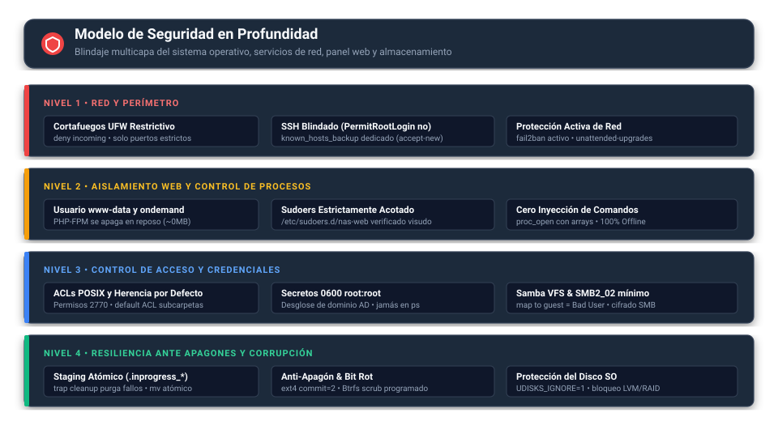

# Seguridad y Endurecimiento • NAS Debian 13

Este documento describe la arquitectura de seguridad, los mecanismos de aislamiento y los procedimientos operativos para mantener el servidor protegido frente a accesos no autorizados, ataques de red, fugas de credenciales y ransomware.

---

## 1. Principio de Defensa en Profundidad

El servidor no confía en una única barrera. Aplica un modelo de **defensa en profundidad** donde cada capa del sistema añade salvaguardas independientes:



---

## 2. Red y Perímetro del Sistema Operativo

### 2.1 Cortafuegos UFW Restrictivo
El firewall se configura con una política de **denegación por defecto para todo tráfico entrante** (`default deny incoming`) y autoriza únicamente los puertos estrictamente necesarios:

| Puerto / Protocolo | Servicio | Justificación |
| :--- | :--- | :--- |
| `22/tcp` | SSH | Administración remota segura de terminal |
| `80/tcp` | Nginx HTTP | Acceso inicial y redirección al panel web |
| `443/tcp` | Nginx HTTPS | Panel web seguro cifrado con TLS |
| `137,138/udp` | Samba NetBIOS | Resolución de nombres de red local |
| `139,445/tcp` | Samba SMB/CIFS | Compartición de archivos en red |
| `3702/udp, tcp` | WSDD2 WSD | Descubrimiento dinámico de Windows |
| `5355/udp, tcp` | WSDD2 LLMNR | Resolución de nombres local sin DNS |
| `5357/tcp` | WSDD2 HTTP | Eventos de descubrimiento en Windows 10/11 |

Cualquier otro puerto (incluyendo servicios de bases de datos o paneles secundarios) queda completamente bloqueado.

---

### 2.2 Blindaje de SSH y Gestión de Huellas
- **Acceso de `root` deshabilitado:** Se aplica `PermitRootLogin no` en `/etc/ssh/sshd_config` y en todos sus archivos drop-in. La administración exige iniciar sesión con un usuario regular y elevar privilegios mediante `sudo`.
- **Almacén dedicado para copias de seguridad:** Las tareas de respaldo por SSH no utilizan el archivo compartido del sistema ni desactivan la comprobación de claves. Emplean `/root/.ssh/known_hosts_backup` (permisos `0600 root:root`) con la directiva `StrictHostKeyChecking=accept-new`.
- **Protección contra ataques *Man-in-the-Middle*:** La primera vez que el servidor se conecta a un host remoto registra su clave pública (TOFU). En conexiones posteriores, si la huella cambia, el runner **aborta de inmediato** con un error explícito en la bitácora, impidiendo conexiones silenciosas a servidores interceptados.

Para registrar o renovar la huella de un host de forma proactiva:
```bash
# Registrar clave inicial
ssh-keyscan -H <IP_O_HOST> >> /root/.ssh/known_hosts_backup

# Actualizar si el host fue reinstalado legítimamente
ssh-keygen -R <IP_O_HOST> -f /root/.ssh/known_hosts_backup
ssh-keyscan -H <IP_O_HOST> >> /root/.ssh/known_hosts_backup
```

---

### 2.3 Protección Activa contra Fuerza Bruta y Parches
- **fail2ban:** Monitoriza los registros de autenticación de SSH y bloquea automáticamente las direcciones IP que acumulen intentos fallidos de acceso.
- **Actualizaciones automáticas (`unattended-upgrades`):** Aplica de forma transparente los parches críticos de seguridad del repositorio oficial de Debian Security (`trixie-security`).
- **Bloqueo de suspensión:** Previene que el servidor entre en reposo o suspensión si alguien pulsa la tecla de encendido o cierra la tapa del equipo (`systemd-logind`).

---

## 3. Aislamiento del Entorno Web y Control de Procesos

El panel de administración web opera bajo un esquema de privilegios mínimos:

1. **Usuario no privilegiado:** Nginx y PHP-FPM se ejecutan bajo la cuenta de sistema `www-data`, sin acceso directo a comandos administrativos.
2. **Superficie de ataque reducida (`pm = ondemand`):** El pool de PHP-FPM apaga los procesos en reposo. Si no hay administradores navegando en el panel, no hay código PHP ejecutándose en memoria.
3. **Escalada acotada mediante Sudoers:** El archivo `/etc/sudoers.d/nas-web` contiene una lista blanca exclusiva con las utilidades requeridas (`systemctl`, `journalctl`, `smbpasswd`, `adcli`, etc.). Se valida siempre con `visudo -c` para impedir errores de sintaxis.
4. **Prevención absoluta de inyección de comandos:** Las clases de servicio PHP (`SystemService`, `BackupService`, `UserService`, `StorageService`) interactúan con el sistema mediante `proc_open` pasando arreglos de parámetros:
   ```php
   // Ejecución segura: NO se invoca /bin/sh -c y los argumentos no se concatenan en texto
   $process = proc_open(['systemctl', 'restart', 'smbd'], $descriptors, $pipes);
   ```
5. **Confinamiento de rutas (Defensa contra *Path Traversal*):** En el explorador de archivos, todas las rutas solicitadas son resueltas mediante `realpath()` y validadas contra la raíz autorizada (`/srv/nas`). Peticiones que contengan `..`, rutas fuera de `/srv/nas` o accesos directos a la papelera oculta son rechazadas con código de error 400/403.
6. **100% Offline (Inmunidad a la cadena de suministro):** Todas las hojas de estilo, scripts y 36 iconos SVG residen en el servidor. No hay llamadas a CDNs externas que puedan ser secuestradas o alteradas remotas.
7. **Cifrado HTTPS y cabeceras de endurecimiento:** El servidor responde por HTTPS con TLS 1.2/1.3, incluyendo cabeceras `X-Content-Type-Options: nosniff`, `X-Frame-Options: SAMEORIGIN` y `X-XSS-Protection: 1; mode=block`.

---

## 4. Credenciales y Ejecución de Respaldos

- **Ubicación protegida:** Las contraseñas de red para respaldos se almacenan en `/etc/backup-credentials/<tarea>.cred` con propietario `root:root` y permisos estrictos `0600`.
- **Verificación previa:** Los scripts de copia comprueban que el archivo de credenciales mantenga los permisos `0600` antes de usarlo. Si detectan permisos laxos, abortan la operación.
- **Sin contraseñas en memoria de comandos (`ps`):** Las contraseñas nunca se pasan como argumentos de línea de comandos. Se suministran a través de archivos de credenciales (`mount.cifs`), descriptores de entrada (`stdin`) o variables de entorno acotadas, y se filtran de los registros.
- **Soporte de dominios corporativos:** El sistema desglosa automáticamente la sintaxis `DOMINIO\usuario` y `DOMINIO/usuario`, almacenando los campos `domain`, `username` y `password` de manera individual.
- **Montaje en solo lectura:** Los recursos Windows se montan con el flag `ro` (Read Only), impidiendo que cualquier proceso en el NAS altere accidentalmente los archivos del servidor de origen.
- **Staging atómico y limpieza en trampas:** Todo respaldo escribe en una carpeta provisional oculta `.inprogress_*`. Los interceptores de señal (`trap cleanup EXIT TERM INT`) garantizan que ante cualquier aborto, corte de energía o error de red, los datos parciales se eliminen de inmediato y el recurso remoto se desmonte.

---

## 5. Protección del Almacenamiento y Recuperación

- **Aislamiento de la unidad del sistema operativo:** La regla udev `80-udisks2-hide-os.rules` aplica `UDISKS_IGNORE="1"` sobre la unidad raíz, ocultándola de herramientas de formateo inadvertido.
- **Bloqueo incondicional de volúmenes en uso:** El motor de despliegue analiza si un disco pertenece a un arreglo RAID o a un volumen físico LVM (PV). Si está en uso, **el sistema prohíbe formatearlo bajo cualquier circunstancia**.
- **Confirmación textual explícita:** Para formatear un disco que solo se encuentra montado en otra ruta, se exige la bandera `--ignore-in-use` y escribir interactivamente `SI-FORMATEAR`. La bandera `--force` nunca sobrepasa discos en uso.
- **Reutilización segura con `--keep-data`:** Permite montar discos existentes en `/srv/nas` reconociendo particiones previas y su sistema de archivos sin formatear.
- **Resiliencia ante apagones:**
  - En discos mecánicos ext4 se fija `commit=2` (vaciado de transacciones cada 2 segundos).
  - En backups con Btrfs se programa `btrfs scrub` mensual para certificar la integridad criptográfica bloque por bloque.

---

## 6. Actualización Segura y Rollback Automático

El comando `sudo nas update` (o la opción [8] del asistente) implementa un ciclo de actualización con verificación integral:

1. **Comprobación de repositorio:** Verifica que la rama activa sea `main` y el origen remoto apunte a `ftole/nas_debian`.
2. **Detección de cambios locales:** Si existen modificaciones sin confirmar en `/opt/nas_debian`, la actualización se cancela para no sobrescribir trabajo local.
3. **Respaldo previo automático:** Antes de aplicar cambios, crea una copia completa del estado actual en `/opt/nas_debian.update_backup_<timestamp>`.
4. **Fusión controlada:** Ejecuta `git merge --ff-only` (solo avance rápido).
5. **Validación post-actualización:**
   - Comprueba la integridad del repositorio con `git fsck`.
   - Verifica la sintaxis de todos los scripts con `bash -n`.
   - Si alguna prueba falla, **restaura automáticamente el respaldo anterior**.
6. **Verificación criptográfica opcional (Tags GPG):**
   Para entornos de alta seguridad, se puede exigir la huella del firmante:
   ```bash
   export NAS_REQUIRE_SIGNED_TAGS=true
   export NAS_UPDATE_SIGNER="<huella-GPG-de-40-hex>"
   ```
   En este modo, el instalador y el actualizador exigen una etiqueta firmada válida (`vMAJOR.MINOR.PATCH`) que coincida con la huella registrada.

Para consultar la versión instalada o revertir manualmente:
```bash
# Ver versión y commit actual
sudo nas version

# Revertir manualmente si fuera necesario
cd /opt/nas_debian && sudo git reset --hard <commit>
```

---

## 7. Gestión de Usuarios, Roles y Acceso Web

El panel incorpora un gestor de identidades nativo (Linux + Samba) con control granular:

- **Roles por grupo (tres niveles):**
  - **`grp_superadmin` (Especial):** cuenta **superadministradora** con control total e **inmutable** (no se puede eliminar, degradar ni suspender). Única con capacidad de otorgar `superadmin`. Se designa en el despliegue (cuenta nueva o existente) y queda registrada en `/etc/nas/superadmin`.
  - **`grp_samba` (Especial):** administrador del servidor (root/sudo + panel completo + SSH).
  - **`grp_web` (Especial):** **operador** del panel: Vista general, Archivos, Logs, Redes compartidas, Respaldos, Usuarios, Servicios, Diagnóstico y Red. Puede crear usuarios estándar, pero no administradores ni superadministradores.
  - **`grp_*` departamentales:** determinan el acceso a las redes compartidas.
- **Permisos por usuario:** contraseña, nombre real/cargo, **Acceso web (operador)**, **Administrador (root/sudo)**, **Superadministrador** (solo visible al superadmin) y **Acceso a red (Samba)**.
- **Política de shell:** los administradores/superadmin usan `/bin/bash`; el resto `/usr/sbin/nologin` (sin consola ni SSH).
- **Grupos especiales** (`grp_superadmin`, `grp_samba`, `grp_web`): no se crean/borran/renombran desde el panel y solo se controlan mediante las casillas de rol del usuario.

### Acceso a recursos compartidos
- El acceso efectivo de un usuario a una carpeta es la **unión** del acceso **por grupo** (`valid users`/`write list`) y de las **concesiones explícitas por usuario**.
- Los recursos de solo lectura (`read only = yes`, esquema 3) nunca reportan escritura.
- **`grp_samba` se incluye siempre** en `valid users` para que los administradores conserven acceso, aunque los grupos especiales no aparezcan en los selectores.
- **Sincronización ACL POSIX:** cada cambio de permisos recalcula las ACL de disco (`setfacl`, con herencia por defecto) para que coincidan con `valid users`/`write list`. La acción **Reparar ACL** (en Usuarios) corrige desajustes que provocaban rechazos de acceso pese a estar autorizado en Samba.

> [!IMPORTANT]
> **Acoplamiento Web↔Samba:** el panel autentica las sesiones contra Samba (`smbclient`). Por tanto, **“Acceso web” requiere que la cuenta Samba esté activa**: desactivar “Acceso a red (Samba)” a un usuario web le retira también el acceso al panel.

